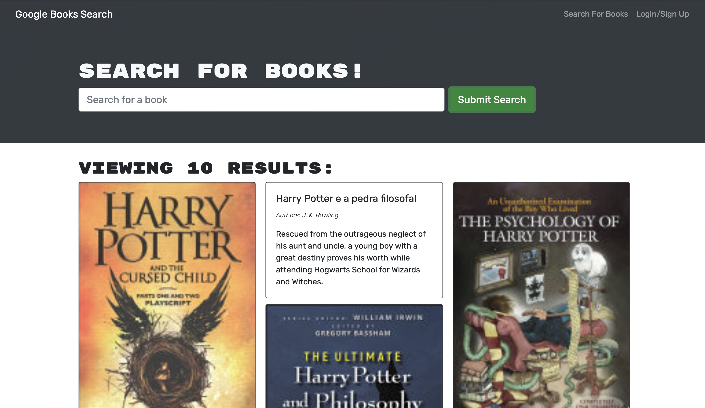

# Book-Search

_Naomi Smith_

## Table of Contents

- [Overview](#Overview)
- [Build](#Build)
- [Installation](#Installation)
- [Usage](#Usage)
- [Contributing](#Contributing)
- [Questions](#Questions)
- [License](#License)

## Overview

 Books are the key to different avenues, the Book Search is available to help the user get there. Presented with options to search for books or Login/Signup. When user types in the name of a book, into the search bar. User is presented with several results. Books can be saved once user logins or makes an account. When required to sign up they are able to input email address, password and username. If user is set to login, they will provide an email address and password. Either direction, the user will be directed to their account and will be able to search books and save them. Both options can be seen in the changed menu once logged in. My saved books, will store books that the user is interested in. Books also have the ability to be removed from user's saved books. Come and read, imagine, discover and grow!  

## Build

- [React](https://reactjs.org/docs/getting-started.html)
- [Node](https://nodejs.org/en/about/)
- [Heroku](https://www.heroku.com/what)
- [MongoDB](https://www.mongodb.com/)

## Installation

To install the application you will need nodeJS and use npm install to get all the related packages for this project. In the terminal type npm run develop to interact with the application on your localhost.

## Usage

### Live Webpage

[Book Search](https://limitless-tundra-47937.herokuapp.com/)

## Contributing

Please reach out via provided Github or Email

## Questions

For any questions about the project, please contact me by either of the following links:

- Email = smithnaomi49@yahoo.com

or visit my GitHub profile:

- GitHub - [Book Search](https://github.com/smithnaomi/Book-Search)

## License

---

 This work is licensed under a <a rel="license" href="http://creativecommons.org/licenses/by-sa/4.0/">Creative Commons Attribution-ShareAlike 4.0 International License</a>.
